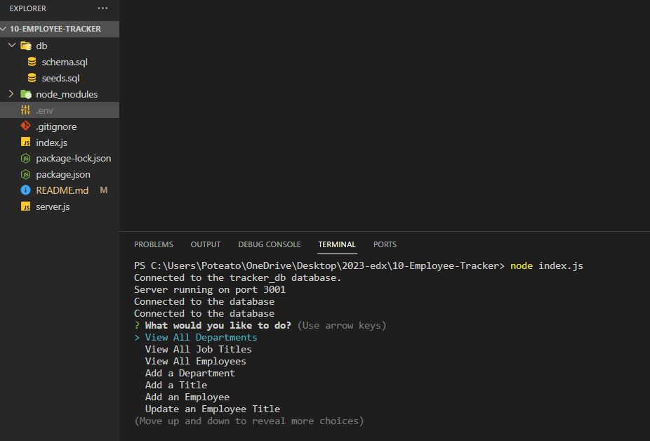

# Employee Tracker



## Description

This application is designed to assist users in efficiently overseeing their employees through a user-friendly command-line interface. Users can effortlessly view, add, and update information within the CLI. During the development of this application, I gained valuable skills in managing prompt lists, assigning functions to each option, and enhancing my understanding of tables and their interconnections through foreign keys.

## Table of Contents (Optional)

If your README is long, add a table of contents to make it easy for users to find what they need.

- [Installation](#installation)
- [Usage](#usage)
- [Credits](#credits)
- [License](#license)

## Installation

All installations should already be provided. The only thing that you will need to have is a dotenv file provided with your own password to your root. 
`DB_PASSWORD: enter your password here`

## Usage


[alt text](assets/images/screenshot.png)


## Credits

N/A

## Codes Used

The code for the challenge can be found in the following file:

- [index.html](/src/index.html): Contains the HTML structure of the landing page.

- [style.css](/src/style.css): Contains the CSS styles for the landing page.

- [script.js](/src/script.js): Contains the Javascript code of the landing page.

--------------------------

- [file name](/src/file) LINE #: Based on the work of [AUTHOR](URL)

```
INSERT CODES HERE
```

## License

N/A

## Badges

N/A

## Features

N/A

## How to Contribute

N/A

## Tests

Go the extra mile and write tests for your application. Then provide examples on how to run them here.